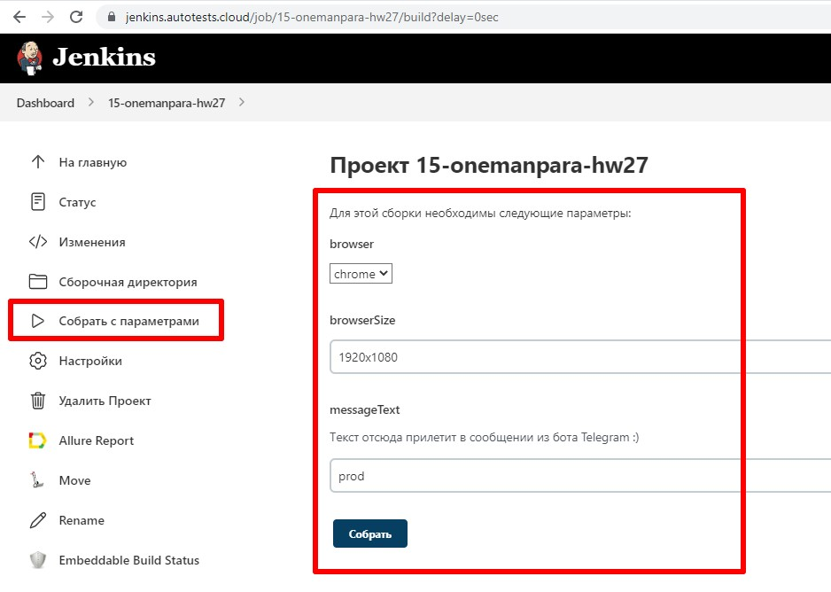
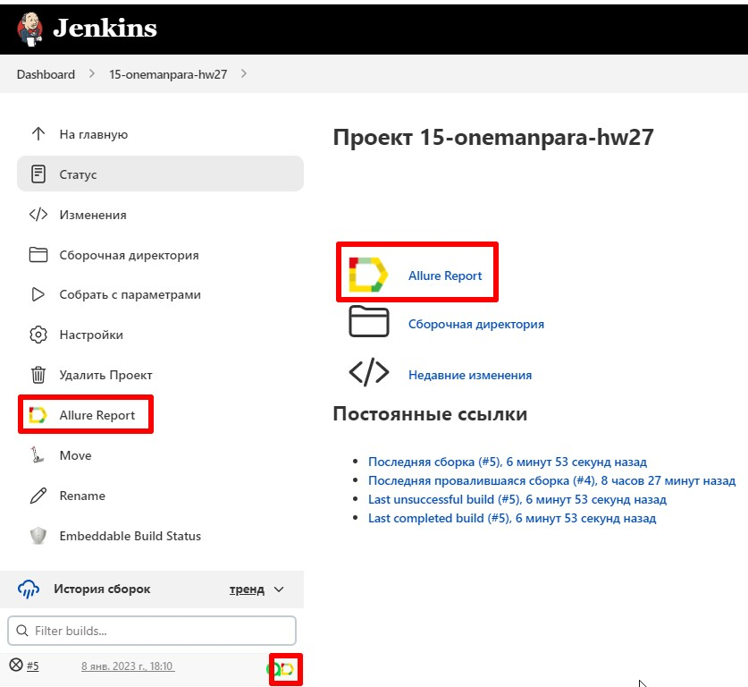
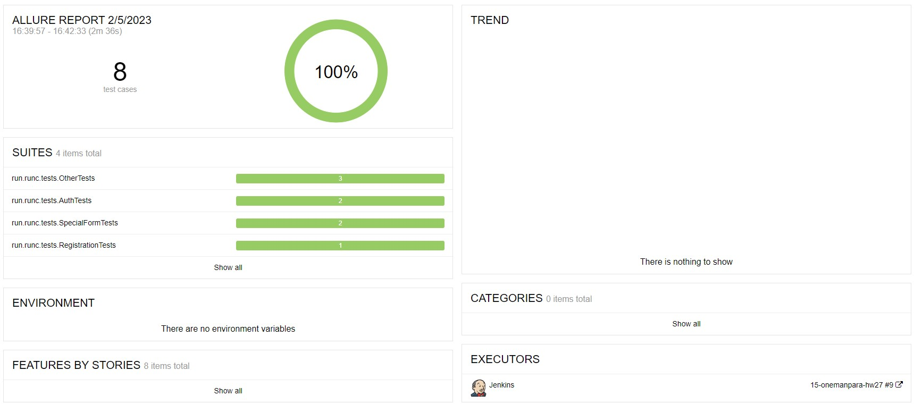
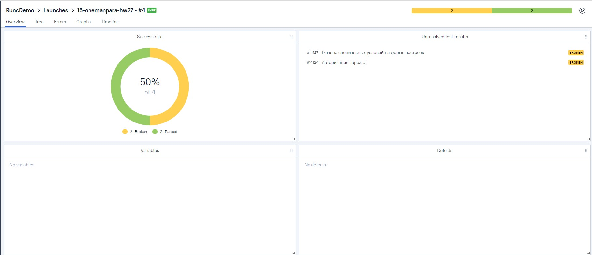
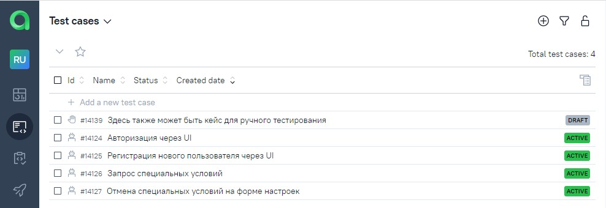
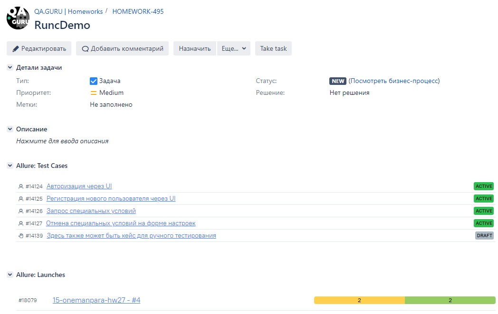
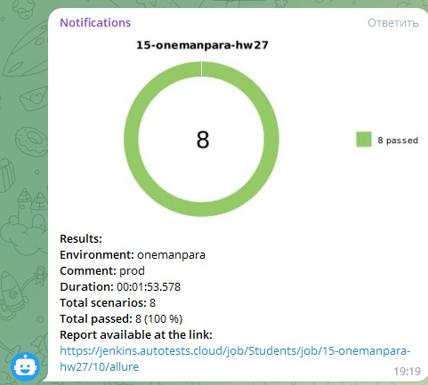
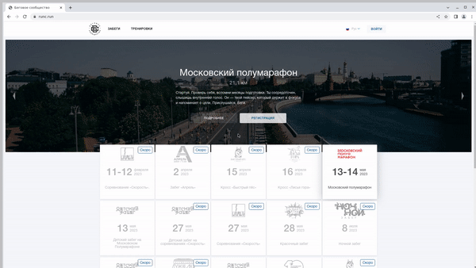

# Проект по автоматизации тестирования сайта Run

## :page_with_curl:	Содержание

> :heavy_check_mark: [Технологии и инструменты](#technologist-технологии-и-инструменты)
>
> :heavy_check_mark: [Реализованы проверки](#bookmark_tabs-реализованы-проверки)
>
> :heavy_check_mark: [Запуск тестов из терминала](#computer-Запуск-тестов-из-терминала)
> 
> :heavy_check_mark: [Запуск тестов в Jenkins](#-запуск-тестов-в-jenkins)
>
> :heavy_check_mark: [Отчет о результатах тестирования в Allure Report](#-отчет-о-результатах-тестирования-в-allure-report)
>
> :heavy_check_mark: [Интеграция с Allure TestOps](#-интеграция-с-allure-testops)
>
> :heavy_check_mark: [Интеграция с Jira](#-интеграция-с-jira)
>
> :heavy_check_mark: [Уведомления в Telegram с использованием бота](#-уведомления-в-telegram-с-использованием-бота)
>
> :heavy_check_mark: [Пример запуска теста в Selenoid](#-пример-запуска-теста-в-selenoid)

## :technologist: Технологии и инструменты

<p  align="center">

<code></code>
<code></code>
<code></code>
<code></code>
<code></code>
<code></code>
<code></code>
<code></code>
<code></code>
<code></code>
<code></code>
<code></code>
</p>

> *В данном проекте автотесты написаны на <code><strong>*Java*</strong></code> с использованием фреймворка <code><strong>*Selenide*</strong></code> для UI-тестов.*
>
>*Для сборки проекта используется <code><strong>*Gradle*</strong></code>.*
>
>*<code><strong>*JUnit 5*</strong></code> используется как фреймворк для модульного тестирования.*
>
>*Запуск тестов выполняется из <code><strong>*Jenkins*</strong></code>.*
>
>*<code><strong>*Selenoid*</strong></code> используется для запуска браузеров в контейнерах  <code><strong>*Docker*</strong></code>.*
>
>*<code><strong>*Allure Report, Telegram Bot*</strong></code> используются для визуализации результатов тестирования.*
> 
>*Тесты написаны с использованием паттерна <code>PageObject</code>*
> 
>*Тесты декомпозированы на операции с <code>API</code> для ускорения работы*

## :bookmark_tabs: Реализованы проверки

>- [x] *Позитивный тест регистрации пользователя через UI*
>- [x] *Позитивный тест авторизации через UI*
>- [x] *Выход с авторизованного пользователя (с предварительной авторизацией по API)*
>- [x] *Возможность отправить заявку на специальную форму (с предварительной регистрацией и авторизацией по API)*
>- [x] *Возможность отменить заявку на специальную форму (с предварительной регистрацией и авторизацией по API*
>- [x] *Наличие ошибок в консоли браузера*
>- [x] *Смена локали сайта (параметризованный тест)*

## :computer: Запуск тестов из терминала

### Локальный запуск тестов

Для запуска всех тестов используйте команду:

```bash
gradle clean test
```

Для запуска тестов, связанных со специальной формой, используйте команду 
```bash
gradle clean specialForm
```
После того, как тесты будут выполненны, используйте следующую команду для формирования отчёта

```bash
gradle allureServe
```

### Сборку можно запустить с параметрами:
```bash
gradle clean test -Dbrowser=${browser} -DbrowserSize=${browser_size} -DmessageText=${messageText} -Dthreads=${threads}
```
> <code>browser</code> – браузер, в котором будут выполняться тесты (_по умолчанию - <code>chrome</code>_).
>
> <code>browser_size</code> – размер окна браузера, в котором будут выполняться тесты (_по умолчанию - <code>1920x1080</code>_).
>
> <code>messageText</code> – сообщение для уведомления в Telegram (_по умолчанию в Jenkins установлено сообщение - <code>prod</code>_).
>
> <code>threads</code> - кол-во потоков для многопоточного запуска
>
> <code>remoteAddress</code> - адрес Selenoid (_по умолчанию в Jenkins создаётся <code>property-файл</code> с данным адресом_)


##  Запуск тестов в [Jenkins](https://jenkins.autotests.cloud/job/15-onemanpara-hw27/)

*Для запуска сборки необходимо указать значения параметров и нажать кнопку <code><strong>*Собрать*</strong></code>.*

<p align="center">
  
</p>

*После выполнения сборки, в блоке <code><strong>*История сборок*</strong></code> напротив номера сборки появится
значок <code><strong>*Allure
Report*</strong></code>, кликнув по которому, откроется страница с сформированным html-отчетом.*

<p align="center">
  
</p>

##  Отчет о результатах тестирования в [Allure Report](https://jenkins.autotests.cloud/job/15-onemanpara-hw27/allure/)

### :pushpin: Общая информация

*Главная страница Allure-отчета содержит следующие информационные блоки:*

> - [x] <code><strong>*ALLURE REPORT*</strong></code> - отображает дату и время прохождения теста, общее количество прогнанных кейсов, а также диаграмму с указанием процента и количества успешных, упавших и сломавшихся в процессе выполнения тестов
>- [x] <code><strong>*TREND*</strong></code> - отображает тренд прохождения тестов от сборки к сборке
>- [x] <code><strong>*SUITES*</strong></code> - отображает распределение результатов тестов по тестовым наборам
>- [x] <code><strong>*ENVIRONMENT*</strong></code> - отображает тестовое окружение, на котором запускались тесты (в данном случае информация не задана)
>- [x] <code><strong>*CATEGORIES*</strong></code> - отображает распределение неуспешно прошедших тестов по видам дефектов
>- [x] <code><strong>*FEATURES BY STORIES*</strong></code> - отображает распределение тестов по функционалу, который они проверяют
>- [x] <code><strong>*EXECUTORS*</strong></code> - отображает исполнителя текущей сборки (ссылка на сборку в Jenkins)

<p align="center">
  
</p>

##  Интеграция с [Allure TestOps](https://allure.autotests.cloud/project/1789/dashboards)

### :pushpin: Основной дашборд

<p align="center">
  
</p>

### :pushpin: Тест-кейсы

<p align="center">
  
</p>

##  Интеграция с [Jira](https://jira.autotests.cloud/browse/HOMEWORK-495)

<p align="center">
  
</p>

##  Уведомления в Telegram с использованием бота

> После завершения сборки специальный бот, созданный в <code>Telegram</code>, автоматически обрабатывает и отправляет сообщение с отчетом о прогоне тестов.

<p align="center">

</p>

##  Пример запуска теста в Selenoid

> К каждому тесту в отчете прилагается видео.
<p align="center">
  
</p>